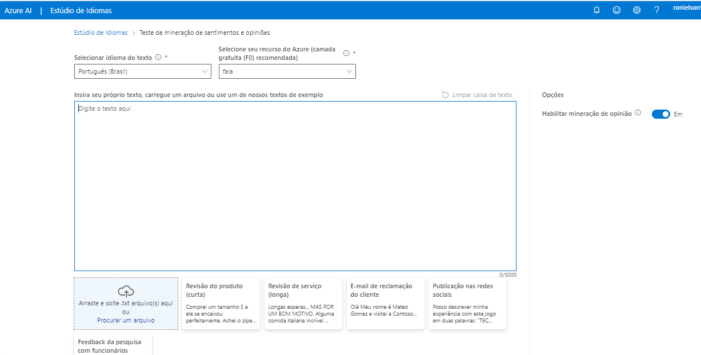

## Compreendendo as emoções de um texto
Neste laboratorio, vamos criar um recurso capaz de identificar as emoções que uma pessoa gostaria de passar atraves de um texto. Afinal, tudo que é escrito passa emoção como: felicidade, raiva, odio, ironia entre outros. Vamos criar um modelo capaz de identificar quais emoções um determinado texto é capaz de transmitir.

## Criando o Recurso
1 - Crie um arquivo de texto e adicione nele alguns comentários aleatórios com elogios e criticas a um serviço de hotel.
2 - Crie um recurso no Language Studio e escolha classificar texto, logo em seguida, em Análise sentimentos e opiniões minhas.
3 - Selecione o idioma do texto, qual recurso será usado e faça o upload do arquivo.
(Conforme image abaixo) 

<ul><li>Lembrando que você também pode digitar o texto sem precisar do arquivo.</li></ul>
4 - Feito isso, selecione o Check Box e clicar em Executar.    

5 - Se você seguiu todos os passsos este será o resultado final:

<ul><li>Note que ele mostra para gente uma pequena arte , no qual demonstra todos os sentimentos do nosso documento e também a porcentagem e a confiança.</li></ul>

<ul><li>Não só no apanhado geral, mas por cada frase também e extraido o sentimento isolado daquela determinada frase.</li></ul>

6 - No fim da para você entender o grau de satisfação de um serviço que está sendo prestado para a sociedade, com base no depoimento das pessoas. 